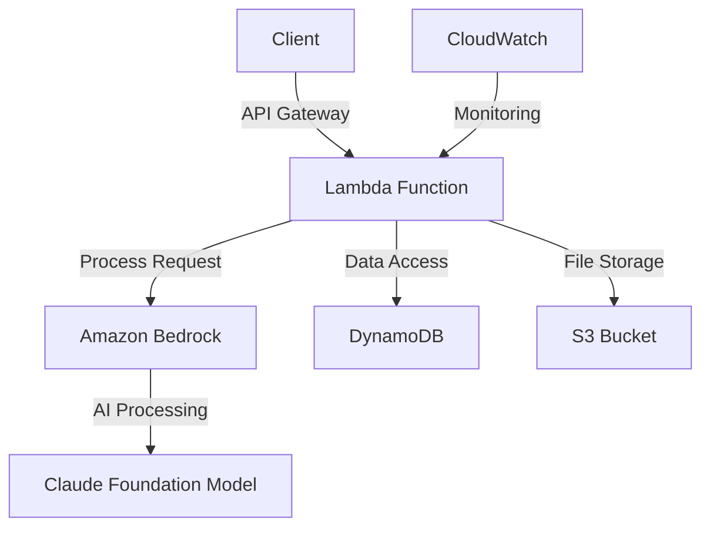

<div align="center">

# Financial Insight AI Agent 🤖📊

[](LICENSE)
[](https://www.python.org/downloads/release/python-3120/)
[](https://docs.aws.amazon.com/cdk/v2/guide/home.html)

[](https://docs.astral.sh/uv/)

> Transform your investment research with AI-powered insights and automated analysis pipelines.

</div>

## 📑 Table of Contents
- [Overview](#-overview)
- [Key Features](#-key-features)
- [Getting Started](#-getting-started)
  - [Prerequisites](#prerequisites)
  - [Installation](#️-installation)
- [Architecture](#️-architecture)
- [Usage Examples](#-usage-examples)
- [Security](#-security)
- [Contributing](#-contributing)
- [Related Resources](#-related-resources)
- [License](#-license)

## 🌟 Overview

The Financial Insight AI Agent is a sophisticated multi-modal assistant that revolutionizes investment research by harnessing the power of artificial intelligence. Built on AWS cloud infrastructure and deployed using the AWS Cloud Development Kit (CDK), this project delivers scalable automated financial analysis capabilities.

### 🎯 Key Features

- **Multi-Modal Analysis Engine**
  - Process diverse data sources including financial statements, market data, and news feeds
  - Generate comprehensive insights through cross-reference analysis
  - Deliver actionable investment recommendations

- **AI-Powered Intelligence**
  - Leverage advanced machine learning models for pattern recognition
  - Employ natural language processing for sentiment analysis
  - Provide predictive analytics for market trends

- **Enterprise-Grade Infrastructure**
  - Infrastructure as Code (IaC) using AWS CDK
  - Automated scaling and resource management
  - Built-in security and compliance features

## 🚀 Getting Started

### Prerequisites

Before you begin, ensure you have the following installed:

- **Python 3.12.5** or later
- **Node.js 22.0.0** or later
- **AWS Account** with appropriate permissions
- **AWS CLI** configured with your credentials

### 🛠️ Installation

#### 1. Set Up Development Environment

```bash
# Clone the repository
git clone https://github.com/your-username/financial-insight-ai-agent
cd financial-insight-ai-agent

# Install uv package manager
curl -LsSf https://astral.sh/uv/install.sh | sh
```

#### 2. Create Python Environment

```bash
# Create and activate virtual environment
uv python install 3.12.5
uv venv --python 3.12.5
source .venv/bin/activate  # On Windows: .venv\Scripts\activate
```

#### 3. Install Dependencies

```bash
# Install project dependencies
uv sync

# Install AWS CDK CLI globally
npm install -g aws-cdk
```

#### 4. Configure AWS Environment

```bash
# Bootstrap AWS CDK in your account
cdk bootstrap

# Deploy the stack
cdk deploy
```

## 🏗️ Architecture



## 💡 Usage Examples

```python
# Example: Initialize the AI agent
from financial_insight import AIAgent

agent = AIAgent()

# Analyze a company's financial health
analysis = agent.analyze_company("AAPL")
print(analysis.summary)
```

## 🔒 Security

- All deployments include AWS WAF integration
- Encrypted data at rest and in transit
- IAM roles with least privilege access
- Regular security audits and updates

## 🤝 Contributing

We welcome contributions! Please follow these steps:

1. Fork the repository
2. Create a feature branch (`git checkout -b feature/AmazingFeature`)
3. Commit your changes (`git commit -m 'Add AmazingFeature'`)
4. Push to the branch (`git push origin feature/AmazingFeature`)
5. Open a Pull Request

## 🔗 Related Resources

- [Amazon Bedrock Samples - Investment Research Assistant](https://github.com/aws-samples/amazon-bedrock-samples/tree/main/agents-and-function-calling/bedrock-agents/use-case-examples/ai-powered-assistant-for-investment-research)
- [AWS CDK Python Reference](https://docs.aws.amazon.com/cdk/api/v2/python/)
- [uv Documentation](https://docs.astral.sh/uv/)

## 📄 License

This project is licensed under the MIT License - see the [LICENSE](LICENSE) file for details.

---
<p align="center">Built with ❤️ for the financial technology community</p>